# UX Design Specification - Aura

**Author:** JMR-OTTER
**Date:** 2026-01-08

---

## Executive Summary

### Project Vision

Aura is an AI-native clinical encounter experience layer built on Ottehr that completes the Quadruple-A framework through intelligent action distribution. The core UX thesis: AI prepares clinical actions on a "silver platter" for one-tap physician approval, then automatically routes each action to the right actor (MA, care manager, patient, caregiver).

**Key UX Differentiators:**

- Shared transparency - clinician and patient see the same screen
- Individual as primary key - longitudinal view, not encounter silos
- Actions Panel - the signature interaction that captures the vision
- CDS-compliant patient-facing AI - gathers info, never diagnoses

### Target Users

**Primary Users (Demo Focus):**

- **Dr. Lisa Chen (Physician)** - Burned out, wants joy back. Needs: scan context in 10 seconds, approve actions in 5 seconds, notes done when patient leaves.

**Secondary Users (Phase 1):**

- **Eleanor Vance (Patient)** - Wants to feel heard. Needs: see her priorities on screen, understand her care plan, leave informed.
- **Marcus Williams (MA)** - Underutilized. Needs: clear pre-visit prep, meaningful post-visit tasks, not just routing.

**Phase 2 Users:**

- **Maria Santos (Caregiver)** - Remote daughter. Needs: instant visit summaries, action items, peace of mind.
- **Denise Carter (Care Manager)** - Drowning in spreadsheets. Needs: priority dashboard, suggested outreach, one-tap actions.
- **Eleanor (Async)** - Between visits. Needs: message care team, get help without phone tag.

### Key Design Challenges

1. **Shared View Information Hierarchy** - Same screen serves clinician workflow and patient understanding. Must design layers of detail that work for both.

2. **Actions Panel Scannability** - 5-10 actions with routing destinations, approachable in 5 seconds, without cognitive overload.

3. **CDS Compliance Visual Language** - Patient-facing AI must feel helpful but never appear to diagnose. Visual cues must reinforce the boundary.

4. **Multi-Actor Coherence** - 6 user types with different needs sharing design language. Component system must flex without fragmenting.

5. **Demo-First Polish** - Dr. Chen journey must be production-quality in 4 weeks. Design system must enable this focus.

### Design Opportunities

1. **"Approve All" as Signature Moment** - Single tap that captures Quadruple-A vision. Design for emotional impact.

2. **Visible AI Thinking** - 2-5 second synthesis becomes trust-building transparency, not frustrating wait.

3. **Collaborative Decision Aids** - "Let's look at your options together" moment. Design for screen-sharing between clinician and patient.

4. **Action Routing Visualization** - Show distribution to Marcus, Denise, Eleanor, Maria. Make the innovation visible.

5. **Patient Priorities First** - Eleanor's words on the screen. Design to maximize emotional resonance.

## Core User Experience

### Defining Experience

**Core Interaction:** Dr. Chen views silver-plattered actions → taps "Approve All" → done.

This single interaction captures the Quadruple-A value proposition. Everything else supports this moment:

- Pre-visit synthesis provides context for understanding actions
- Decision aids explain why these specific actions
- Documentation auto-generates from approved actions
- Action routing distributes to the right actors automatically

**Demo Success = This Interaction Works Flawlessly**

### Platform Strategy

| Platform        | Use Case                                    | Demo Priority |
| --------------- | ------------------------------------------- | ------------- |
| **Desktop Web** | EHR workstation (primary clinical workflow) | Must          |
| **Tablet Web**  | In-room shared view with patient            | Nice          |
| **Mobile Web**  | Patient/caregiver access                    | Phase 1       |
| **Telehealth**  | Video + clinical tools                      | Phase 1       |

**Technical Constraints:**

- Built on Ottehr stack (React 18, MUI 5, Zustand, React Query)
- Real-time sync required (sub-500ms propagation)
- No offline requirement for demo
- Must integrate with existing Ottehr patterns

**Input Methods:**

- Desktop: Mouse/keyboard optimized
- Tablet: Touch-friendly for shared decision moments
- Mobile: Touch-first for patient interactions

### Effortless Interactions

**Zero-Thought Design Targets:**

| Interaction             | From (Pain)                        | To (Effortless)                        |
| ----------------------- | ---------------------------------- | -------------------------------------- |
| Pre-visit prep          | 3+ minutes hunting through chart   | 10-second AI synthesis scan            |
| Approve orders          | 15+ clicks across multiple screens | One tap "Approve All"                  |
| Documentation           | 20 minutes after patient leaves    | Auto-generated, done at visit end      |
| Action routing          | Manual orders, faxes, follow-ups   | Automatic distribution on approval     |
| Know patient priorities | Ask again every visit              | Already displayed from pre-visit input |

**Automatic Behaviors:**

- Context appears when encounter starts (no searching)
- Actions pre-populated based on conversation (no building)
- Routing destinations pre-determined by action type (no decisions)
- Note structure determined by encounter content (no template selection)

### Critical Success Moments

| Moment               | Experience                      | Design Implication                                                 |
| -------------------- | ------------------------------- | ------------------------------------------------------------------ |
| **First Scan**       | "I know exactly where to start" | Information hierarchy optimized for 10-second comprehension        |
| **Approve All**      | One tap, everything flows       | Button prominence, satisfying feedback, visible downstream effects |
| **Patient Priority** | "My words are on the screen"    | Patient input displayed prominently, verbatim when possible        |
| **Notes Complete**   | "I can walk the patient out"    | Auto-generation fast, editing minimal, sign-off simple             |
| **Demo Aha**         | "This changes everything"       | End-to-end flow feels magical, not mechanical                      |

### Experience Principles

1. **Silver Platter, Not Menu**

   - Present curated decisions, not raw options
   - AI does the cognitive work, clinician validates
   - Default to "approve" not "build from scratch"

2. **5-Second Scan**

   - Any screen comprehensible in 5 seconds
   - Visual hierarchy guides eye immediately to what matters
   - If it takes longer to understand, simplify

3. **One Tap Completes**

   - Minimize clicks for common flows
   - Batch related actions together
   - "Approve All" as the ideal interaction pattern

4. **Visible Distribution**

   - Show where each action routes (Marcus, Denise, Eleanor, Maria)
   - The routing IS the innovation - make it visible
   - Actor icons/names next to each action

5. **Patient Words First**

   - Eleanor's priorities in her language, verbatim
   - Display prominently, not buried in chart
   - Emotional resonance > clinical efficiency

6. **Trust Through Transparency**
   - Show AI reasoning for suggestions
   - "Based on..." visible for each action
   - Don't hide the machine - let clinician verify

## Desired Emotional Response

### Primary Emotional Goals

**Overarching Theme: Restoration**

Aura restores what modern healthcare has taken away:

- **For Clinicians:** Joy in practice, time with patients, work-life balance
- **For Patients:** Feeling heard, partnership in care, understanding
- **For Care Teams:** Purpose, meaningful contribution, professional satisfaction

| User                  | Primary Emotion     | Success Statement                    |
| --------------------- | ------------------- | ------------------------------------ |
| Dr. Chen (Physician)  | Joy / Relief        | "I actually enjoyed work today"      |
| Eleanor (Patient)     | Heard / Partnership | "It was like they actually listened" |
| Maria (Caregiver)     | Peace of Mind       | "I finally feel like I can help"     |
| Marcus (MA)           | Valued / Purpose    | "The MA who explained everything"    |
| Denise (Care Manager) | Effective / Meaning | "The nurse I went to school to be"   |

### Emotional Journey Mapping

**Dr. Chen Journey (Demo Focus):**

| Stage        | Current State | Aura Target  |
| ------------ | ------------- | ------------ |
| Pre-visit    | Dread         | Anticipation |
| First Scan   | Anxiety       | Confidence   |
| During Visit | Distraction   | Presence     |
| Approve All  | Overwhelm     | Satisfaction |
| End of Visit | Incomplete    | Completion   |
| End of Day   | Exhaustion    | Balance      |

**Eleanor Journey:**

| Stage        | Current State                  | Aura Target                      |
| ------------ | ------------------------------ | -------------------------------- |
| Before Visit | Worried (questions on notepad) | Heard (submitted concerns)       |
| Arrival      | Anxious (will there be time?)  | Seen (priorities on screen)      |
| During Visit | Passive (doctor types)         | Partner (shared decision-making) |
| After Visit  | Confused (what happened?)      | Informed (clear care plan)       |

### Micro-Emotions

**Trust vs. Skepticism**

- AI-assisted clinical decisions require earned trust
- Show reasoning for every suggestion
- Allow easy override without friction
- Never auto-submit clinical orders
- "I trust Aura because I can see why"

**Confidence vs. Confusion**

- First scan must immediately orient
- Clear visual hierarchy, no hunting
- Consistent patterns across screens
- "I know exactly what I'm looking at"

**Accomplishment vs. Frustration**

- "Approve All" must feel satisfying
- Visible progress through encounter
- Clear success states
- "That felt good - everything just worked"

**Connection vs. Isolation**

- Shared view creates partnership
- Patient words visible to both parties
- Collaborative decision moments
- "We're doing this together"

**Emotions to Avoid:**

- **Surveillance:** AI as partner, not monitor
- **Incompetence:** Suggestions augment, not replace clinical judgment
- **Depersonalization:** Patient as partner, not data point
- **Overwhelm:** Information density calibrated for scan speed

### Design Implications

| Target Emotion   | Design Approach                                                                |
| ---------------- | ------------------------------------------------------------------------------ |
| **Joy**          | Reduce clicks aggressively, auto-complete routine tasks, show time saved       |
| **Trust**        | Transparent AI reasoning, easy edit/override, no forced acceptance             |
| **Heard**        | Patient words verbatim, priorities displayed first, not buried in chart        |
| **Confidence**   | Strong visual hierarchy, consistent patterns, 5-second comprehension           |
| **Satisfaction** | Prominent "Approve All", satisfying micro-animation, clear success state       |
| **Connection**   | Same screen composition for patient and clinician, shared decision aid views   |
| **Purpose**      | Role-specific queues, meaningful task descriptions, visible impact on outcomes |

### Emotional Design Principles

1. **Restoration Over Optimization**

   - Not about doing more faster
   - About reclaiming what was lost: presence, partnership, purpose

2. **Earned Trust**

   - Every AI suggestion must show reasoning
   - Trust is built incrementally, not assumed
   - Easy escape hatches preserve autonomy

3. **Visible Care**

   - Patient sees they matter (priorities displayed)
   - Clinician sees impact (quality gaps closed)
   - Care team sees contribution (actions completed)

4. **Satisfying Moments**

   - "Approve All" should feel like checking off a big list
   - Completion states should provide closure
   - End of day should feel earned, not escaped

5. **No Surveillance Feeling**
   - AI is colleague, not supervisor
   - Suggestions, not mandates
   - Clinician remains the decision-maker

## UX Pattern Analysis & Inspiration

### Inspiring Products Analysis

**Primary Reference: DynamicScribe Prototype**

Direct UX patterns to adopt from the existing prototype:

| Component    | Pattern                                         | Adoption Strategy                       |
| ------------ | ----------------------------------------------- | --------------------------------------- |
| ActionsPanel | Collapsible panel with badge count              | Adopt directly, add routing indicators  |
| CarePlan     | Status chips (active/new/modified/discontinued) | Adopt, enhance with FHIR status mapping |
| DecisionAid  | Pros/cons grid with recommendation highlight    | Adopt for shared decision moments       |
| Transcript   | Speaker avatars, inline AI insights             | Adapt for Phase 2 (demo uses simulated) |
| Agenda       | Three-source visual distinction                 | Adopt for multi-priority tracking       |

**Secondary Inspirations:**

| Product Category | Inspiration Source | Pattern to Extract                                        |
| ---------------- | ------------------ | --------------------------------------------------------- |
| Task Management  | Todoist, Things 3  | One-tap complete, batch operations, satisfying animations |
| Collaboration    | Figma, Notion      | Real-time presence, progressive disclosure, clean density |
| AI Assistants    | Claude, ChatGPT    | "Thinking" indicators, streaming output, edit/regenerate  |
| Healthcare       | MyChart, athena    | What NOT to do - see anti-patterns                        |

### Transferable UX Patterns

**Navigation Patterns:**

| Pattern                | Source | Aura Application                           |
| ---------------------- | ------ | ------------------------------------------ |
| Persistent context bar | Figma  | Patient summary always visible at top      |
| Role-based views       | Slack  | Same data, different layouts per user type |
| Progressive disclosure | Apple  | Summary first, expand for clinical detail  |

**Interaction Patterns:**

| Pattern        | Source          | Aura Application                       |
| -------------- | --------------- | -------------------------------------- |
| Batch approval | Gmail           | "Approve All" actions in one tap       |
| Swipe gestures | Mobile patterns | Fast triage on tablet (approve/reject) |
| Inline editing | Notion          | Edit AI-generated text without modal   |
| Drag-to-assign | Trello          | Manual routing override (Phase 2)      |

**Visual Patterns:**

| Pattern             | Source      | Aura Application                         |
| ------------------- | ----------- | ---------------------------------------- |
| Status chips        | GitHub      | Action status, care plan item state      |
| Card-based layout   | Notion      | Scannable, expandable content units      |
| Timeline view       | Git history | Longitudinal care plan changes           |
| Presence indicators | Figma       | Show shared view (Eleanor sees this too) |

**AI-Specific Patterns:**

| Pattern              | Source     | Aura Application                  |
| -------------------- | ---------- | --------------------------------- |
| Streaming output     | Claude     | Real-time synthesis feel          |
| Source attribution   | Perplexity | "Based on A1C of 6.8%" citations  |
| Confidence indicator | ML tools   | Visual flagging of uncertainty    |
| Regenerate option    | ChatGPT    | Clinician can request alternative |

### Anti-Patterns to Avoid

**Traditional EHR Anti-Patterns:**

| Anti-Pattern            | Problem                    | Aura Alternative                          |
| ----------------------- | -------------------------- | ----------------------------------------- |
| Click-heavy workflows   | 15+ clicks per order       | One-tap batch approval                    |
| Modal overload          | Constant flow interruption | Inline actions, minimal modals            |
| Dense text walls        | Can't scan in 5 seconds    | Cards, chips, visual hierarchy            |
| Hidden information      | Hunt through tabs          | Single-view encounter context             |
| Generic alerts          | Alert fatigue, ignored     | Contextual, actionable-only notifications |
| Encounter-centric silos | Longitudinal context lost  | Individual as primary key                 |

**Ambient Scribe Anti-Patterns:**

| Anti-Pattern       | Problem                    | Aura Alternative                    |
| ------------------ | -------------------------- | ----------------------------------- |
| Documentation-only | Stops at Aggregate step    | Complete Quadruple-A (Act)          |
| Post-visit review  | Notes after patient leaves | Real-time, done at encounter end    |
| Black-box AI       | No reasoning visible       | Transparent "based on..." citations |
| Physician dumping  | All actions to MD          | Intelligent routing to right actor  |

### Design Inspiration Strategy

**Adopt Directly:**

- DynamicScribe ActionsPanel component structure
- DynamicScribe CarePlan status chip system
- DecisionAid pros/cons grid layout
- One-tap batch approval pattern
- Streaming AI output visualization

**Adapt for Aura:**

- Figma presence indicators → "Eleanor sees this view" badge
- Notion progressive disclosure → Clinical detail expansion
- Claude source citations → FHIR-sourced "Based on..." references
- Todoist completion animations → "Approve All" satisfaction moment

**Avoid Completely:**

- Modal-heavy interaction flows
- Post-visit documentation review
- Hidden AI reasoning
- Click-intensive order entry
- Generic, non-actionable alerts
- Encounter-centric information silos

## Design System Foundation

### Design System Choice

**Selected:** MUI 5 (Material UI) with custom Aura theme

**Decision Type:** Constrained choice (brownfield on Ottehr)

Aura is built on the Ottehr codebase, which standardizes on MUI 5. This is not a recommendation - it's a requirement for:

- Consistency with existing Ottehr UI patterns
- Leverage of existing component library (`packages/ui-components`)
- Developer familiarity and velocity
- Reduced maintenance burden

### Rationale for Selection

**Technical Alignment:**

- Ottehr uses React 18 + MUI 5 + Zustand + React Query
- Established theming infrastructure exists
- Component patterns documented in development guide
- Accessibility compliance (WCAG 2.1 AA) built-in

**Pattern Support:**

| Aura Pattern Need      | MUI 5 Solution                             |
| ---------------------- | ------------------------------------------ |
| Status chips           | `<Chip>` with color variants               |
| Card-based layout      | `<Card>`, `<CardContent>`, `<CardActions>` |
| Progressive disclosure | `<Accordion>`, `<Collapse>`                |
| Batch operations       | Checkbox patterns, SelectAll               |
| Visual hierarchy       | Typography scale, consistent spacing       |

**DynamicScribe Translation:**
DynamicScribe's Tailwind/Radix patterns will be re-implemented in MUI:

- Conceptual patterns adopted (ActionsPanel, CarePlan, DecisionAid)
- Visual implementation translated to MUI components
- Interaction behaviors preserved

### Implementation Approach

**Theme Architecture:**

```
ottehr/
├── packages/ui-components/       # Shared components (existing)
├── apps/ehr/
│   └── src/
│       └── features/
│           └── aura/            # Aura feature module
│               ├── theme/       # Aura theme extensions
│               │   ├── palette.ts
│               │   ├── typography.ts
│               │   └── components.ts
│               └── components/  # Aura-specific components
│                   ├── ActionsPanel/
│                   ├── CarePlanCard/
│                   ├── DecisionAid/
│                   └── DocumentationReview/
```

**Theme Extension Strategy:**

- Extend Ottehr's existing theme (don't replace)
- Add Aura-specific palette colors (AI accent, status colors)
- Create component variants for clinical context
- Maintain consistency with Ottehr base patterns

### Customization Strategy

**Palette Extensions:**

| Token                      | Purpose                        | Example Use                     |
| -------------------------- | ------------------------------ | ------------------------------- |
| `aura.aiAccent`            | AI-generated content indicator | Synthesis cards, suggestions    |
| `aura.approve`             | Positive action                | Approve buttons, success states |
| `aura.reject`              | Negative action                | Reject/dismiss actions          |
| `aura.routing.ma`          | MA routing indicator           | Action assignments              |
| `aura.routing.careManager` | Care manager routing           | Action assignments              |
| `aura.routing.patient`     | Patient routing                | Action assignments              |

**Component Variants:**

| Base Component | Aura Variant       | Purpose                                                  |
| -------------- | ------------------ | -------------------------------------------------------- |
| `Chip`         | `StatusChip`       | Care plan item status (active/new/modified/discontinued) |
| `Chip`         | `ActionChip`       | Action type indicator (prescribe/order/referral)         |
| `Chip`         | `RoutingChip`      | Actor assignment (MA/Care Manager/Patient)               |
| `Card`         | `ActionCard`       | Individual action in ActionsPanel                        |
| `Card`         | `CarePlanItemCard` | Care plan item with status and metrics                   |
| `Button`       | `ApproveAllButton` | Primary batch approval action                            |

**Typography Adjustments:**

- Increase body text size for scan readability
- Stronger heading hierarchy for 5-second comprehension
- Monospace option for clinical values (A1C: 6.8%)

**Spacing Adjustments:**

- Generous touch targets (minimum 44px) for tablet use
- Card padding optimized for information density
- Consistent 8px grid system

## Defining Experience

### The Core Interaction

**Defining Experience:** "Silver-platter actions, one-tap approve, everything flows"

This is Aura's signature moment - the interaction that captures the entire Quadruple-A value proposition in a single tap. Users will describe it as:

> "The AI prepares everything, I tap once, and it all just happens - prescriptions sent, orders placed, patient notified, notes done."

**Why This Defines Aura:**

- Completes Quadruple-A framework (Act step) in one interaction
- Differentiates from ambient scribes (they stop at documentation)
- Delivers emotional promise (joy restored, time reclaimed)
- Makes innovation visible (action routing to multiple actors)

### User Mental Model

**Current Mental Model (EHR users):**

- "I decide, then I execute each decision separately"
- "Orders are individual tasks I complete one by one"
- "AI might help me write notes, but I still do the work"
- "Post-visit inbox work is inevitable"

**Aura Mental Model Shift:**

- "I review and approve, AI executes"
- "Decisions are batched and approved together"
- "AI did the work, I verify and release"
- "Visit is complete when I walk the patient out"

**Potential Confusion Points:**

| Confusion                       | Design Mitigation                   |
| ------------------------------- | ----------------------------------- |
| "Did it really send?"           | Clear confirmation with specifics   |
| "What did I approve?"           | Expandable audit trail              |
| "What if I want to change one?" | Granular edit/reject on each action |
| "Can I undo?"                   | 5-second undo window                |

### Success Criteria

| Criterion     | Target                       | Measurement                       |
| ------------- | ---------------------------- | --------------------------------- |
| Speed         | View → Approved in 5 seconds | Usability testing timer           |
| Confidence    | No hesitation on tap         | Eye tracking, hesitation analysis |
| Comprehension | Can recall what was approved | Post-action recall test           |
| Trust         | Would use again              | Repeat usage rate                 |
| Satisfaction  | Feels good                   | NPS, qualitative feedback         |

**Success Indicators:**

- Scans Actions Panel in under 5 seconds
- Taps "Approve All" without reviewing each item individually
- Can accurately recall approved actions afterward
- Doesn't feel need to verify in EHR after

### Novel UX Patterns

**Pattern Type:** Novel in healthcare, adapted from consumer patterns

**Novel Elements for Healthcare:**

- AI-curated action suggestions (not template order sets)
- Batch approval of mixed action types (Rx + lab + referral + task)
- Visible routing to different actors (not just "to pharmacy")
- One-tap completion of entire visit's clinical actions

**Familiar Pattern Adaptations:**

| Source Pattern           | Aura Adaptation                                |
| ------------------------ | ---------------------------------------------- |
| Email "Archive All"      | Batch clear actions with one tap               |
| Shopping cart checkout   | Review items, one-tap complete                 |
| Code review "Approve PR" | Review AI suggestions, approve with one action |
| Notification "Clear All" | Dismiss/complete multiple items instantly      |

**Teaching the Pattern:**

1. **First use:** Guided walkthrough showing what happens on approval
2. **Animation:** Actions visually flow to their routing destinations
3. **Confirmation:** Specific feedback: "3 to Marcus, 2 to Eleanor, 1 to pharmacy"
4. **Undo window:** 5-second recovery option for accidental approval

### Experience Mechanics

**1. Initiation**

| Stage            | Design                                                        |
| ---------------- | ------------------------------------------------------------- |
| Passive state    | Actions Panel visible but collapsed, badge shows action count |
| During encounter | Panel updates as conversation progresses                      |
| Ready state      | At wrap-up, panel auto-expands with "Ready to approve"        |
| Trigger          | Visible "Approve All (7)" button invites action               |

**2. Interaction**

| Element            | Design                                                    |
| ------------------ | --------------------------------------------------------- |
| Layout             | Vertical list of ActionCards                              |
| ActionCard         | Type icon + Title + Routing chip + Actions                |
| Scanning           | Color-coded by type (Rx=blue, Lab=purple, Referral=green) |
| Routing visibility | Chip shows "→ Marcus" or "→ Eleanor" on each card         |
| Granular control   | Hover reveals Edit/Reject on individual actions           |
| Primary CTA        | Large "Approve All (N)" button, prominent position        |
| One-tap            | Single click/tap triggers approval of all actions         |

**3. Feedback**

| Timing               | Feedback                                               |
| -------------------- | ------------------------------------------------------ |
| Immediate (0ms)      | Button state change, ripple animation                  |
| Progress (0-500ms)   | Actions animate outward toward routing icons           |
| Confirmation (500ms) | Toast: "Approved 7 actions"                            |
| Details              | Expandable in toast: "Rx to pharmacy, Lab to Quest..." |
| Undo (0-5s)          | "Undo" link in toast for 5 seconds                     |
| Settled (5s+)        | Toast dismisses, actions are final                     |

**4. Completion**

| Element      | Design                                                     |
| ------------ | ---------------------------------------------------------- |
| Empty state  | Actions Panel shows "All actions completed" with checkmark |
| Audit access | "View approved actions" link for review                    |
| Next step    | Documentation Review auto-surfaces as next focus           |
| Visit status | "Visit complete" indicator visible                         |
| Confidence   | Dr. Chen can walk Eleanor out knowing everything is done   |

## Visual Design Foundation

### Color System

**Brand Palette:**

| Token               | Value               | Usage                           |
| ------------------- | ------------------- | ------------------------------- |
| `aura.primary`      | #0D7377 (Deep Teal) | Primary actions, brand identity |
| `aura.primaryLight` | #14A3A8             | Hover states                    |
| `aura.primaryDark`  | #0A5C5E             | Active states                   |

**Rationale:** Teal conveys trust, calm, and innovation - aligns with "restoration" emotional theme without clinical blue sterility.

**Semantic Colors:**

| Token     | Value   | Usage                          |
| --------- | ------- | ------------------------------ |
| `success` | #2E7D32 | Approvals, completed, positive |
| `warning` | #ED6C02 | Attention needed, pending      |
| `error`   | #D32F2F | Errors, rejected, critical     |
| `info`    | #0288D1 | Informational, AI insights     |

**AI Accent:**

| Token               | Value                 | Usage                          |
| ------------------- | --------------------- | ------------------------------ |
| `aura.aiAccent`     | #7C4DFF (Soft Purple) | AI-generated content indicator |
| `aura.aiBackground` | #F3E5F5               | AI suggestion card backgrounds |

**Routing Colors (Actor Assignment):**

| Actor        | Token                 | Color            |
| ------------ | --------------------- | ---------------- |
| Physician    | `routing.physician`   | #0D7377 (Teal)   |
| MA           | `routing.ma`          | #F57C00 (Orange) |
| Care Manager | `routing.careManager` | #7B1FA2 (Purple) |
| Patient      | `routing.patient`     | #388E3C (Green)  |
| Caregiver    | `routing.caregiver`   | #1976D2 (Blue)   |
| External     | `routing.external`    | #616161 (Gray)   |

**Status Colors (Care Plan):**

| Status       | Token                 | Color   |
| ------------ | --------------------- | ------- |
| Active       | `status.active`       | #757575 |
| New          | `status.new`          | #4CAF50 |
| Modified     | `status.modified`     | #FFC107 |
| Discontinued | `status.discontinued` | #EF5350 |
| Confirmed    | `status.confirmed`    | #0D7377 |

### Typography System

**Font Stack:**

- Primary: Inter, system-ui, -apple-system, sans-serif
- Monospace: JetBrains Mono, Consolas, monospace

**Type Scale:**

| Level      | Size | Weight | Line Height | Usage               |
| ---------- | ---- | ------ | ----------- | ------------------- |
| Display    | 32px | 600    | 1.25        | Patient name header |
| H1         | 24px | 600    | 1.25        | Section headers     |
| H2         | 20px | 600    | 1.3         | Card titles         |
| H3         | 16px | 600    | 1.4         | Subsection headers  |
| Body Large | 16px | 400    | 1.5         | Emphasized content  |
| Body       | 14px | 400    | 1.5         | Default text        |
| Caption    | 12px | 400    | 1.4         | Labels, metadata    |
| Overline   | 11px | 500    | 1.3         | Category labels     |

**Typography Principles:**

- Optimize for 5-second scan (strong hierarchy)
- Clinical values in monospace (A1C: 6.8%)
- Patient words in distinct style (quotes, emphasis)

### Spacing & Layout Foundation

**Base Unit:** 8px grid

**Spacing Scale:**

| Token         | Value | Usage              |
| ------------- | ----- | ------------------ |
| `spacing.xs`  | 4px   | Intra-component    |
| `spacing.sm`  | 8px   | Component padding  |
| `spacing.md`  | 16px  | Element separation |
| `spacing.lg`  | 24px  | Section separation |
| `spacing.xl`  | 32px  | Major breaks       |
| `spacing.xxl` | 48px  | Page-level         |

**Touch Targets:** Minimum 44px height for interactive elements

**Layout Grid:**

- 12-column grid system (MUI default)
- Responsive breakpoints: xs(0), sm(600), md(900), lg(1200), xl(1536)
- Maximum content width: 1440px

**Density:**

- Medium-high information density (clinical context)
- Generous white space between sections
- Tight spacing within card components

### Accessibility Considerations

**Color Contrast:**

- All text meets WCAG 2.1 AA (4.5:1 for body, 3:1 for large text)
- Status colors have sufficient contrast against backgrounds
- Never rely on color alone (always include icons/text)

**Focus States:**

- Visible focus indicators on all interactive elements
- Focus ring: 2px solid with offset
- Keyboard navigation fully supported

**Motion:**

- Respect prefers-reduced-motion
- Animations enhance, never required
- AI "thinking" indicator works without animation

**Screen Reader Support:**

- Semantic HTML structure
- ARIA labels for icons and complex components
- Live regions for dynamic content (action approval feedback)

## Design Direction Decision

### Design Direction Selected

**Direction:** "Clinical Focus" - Information-dense, action-oriented, scan-optimized

**Core Principle:** Optimize for 5-second comprehension and one-tap action completion.

This direction prioritizes:

- Scan speed over visual polish
- Action enablement over data display
- Clinician workflow over aesthetic innovation
- Trust indicators over decorative elements

### Layout Architecture

**Encounter View (Primary):**

| Zone                | Position             | Purpose                                       |
| ------------------- | -------------------- | --------------------------------------------- |
| Patient Context Bar | Top, persistent      | Always-visible patient identity and concerns  |
| Pre-visit Synthesis | Left, upper          | AI summary and context for decision-making    |
| Actions Panel       | Right, prominent     | Silver-plattered actions with "Approve All"   |
| Decision Aids       | Overlay or inline    | Surfaces contextually during shared decisions |
| Care Plan           | Left or right, lower | Longitudinal view with status indicators      |
| Documentation       | Slides in            | Auto-generated note review                    |

**Layout Rationale:**

- Right-side Actions Panel mirrors right-hand mouse position (majority users)
- Patient context always visible reduces error risk
- Synthesis before Actions supports informed approval
- Care Plan persistence supports longitudinal thinking

### Visual Hierarchy

**Primary Focus (Highest Weight):**

- Patient name and identifying context
- "Approve All" button
- Patient's stated priorities (verbatim)
- Critical quality gaps

**Secondary Focus (Medium Weight):**

- Individual action items
- Care Plan status changes
- AI synthesis key points

**Tertiary (Lowest Weight):**

- Historical reference data
- Timestamps and metadata
- Navigation and system UI

### Interaction Patterns

**Direct Manipulation Approach:**

| Pattern           | Implementation                          |
| ----------------- | --------------------------------------- |
| Approval          | One-tap, no confirmation modal          |
| Editing           | Inline, escape to cancel                |
| Detail access     | Collapse/expand, not navigation         |
| Action management | Individual approve/edit/reject on hover |

**Feedback Approach:**

| Action     | Feedback                               |
| ---------- | -------------------------------------- |
| Tap/Click  | Immediate ripple animation             |
| Approval   | Toast with details, 5s undo            |
| Routing    | Animated flow to destination indicator |
| Completion | Panel state change, checkmark          |

### Density Strategy

**High Density Zones:**

- Actions Panel: Compact cards, type icon + title + routing only
- Care Plan: One-line items with status chip
- Quality gaps: Scannable list, no unnecessary detail

**Standard Density Zones:**

- Pre-visit synthesis: Readable prose, clear sections
- Decision aids: Spacious comparison grid
- Documentation: Comfortable editing space

**Rationale:** Clinical context requires information density, but core actions need breathing room for confident interaction.

### Design Direction Constraints

**What This Direction Excludes:**

- Decorative illustrations or graphics
- Animated transitions beyond functional feedback
- Complex navigation hierarchies
- Modal-heavy interaction flows
- Skeuomorphic design elements

**What This Direction Requires:**

- Consistent visual language across all components
- Clear status indicators on every stateful element
- Visible AI attribution on generated content
- Touch-friendly targets for tablet use
- Keyboard accessibility for power users

## User Journey Flows

### Journey 1: Dr. Lisa Chen - Clinical Encounter Flow

**Goal:** Complete a clinical encounter from pre-scan to patient walkout with zero post-visit documentation burden.

**Flow Design:**

```mermaid
flowchart TD
    subgraph PreVisit["Pre-Visit (Before Room Entry)"]
        A[Dr. Chen opens patient chart] --> B{Aura synthesis<br/>ready?}
        B -->|Yes| C[10-second scan:<br/>Patient concerns + gaps + context]
        B -->|No| C1[AI thinking indicator<br/>2-5 seconds]
        C1 --> C
        C --> D[Mental model formed]
    end

    subgraph Encounter["During Encounter"]
        D --> E[Greet Eleanor:<br/>"I saw your message..."]
        E --> F[Conversation flows naturally]
        F --> G{Decision<br/>point?}
        G -->|Yes| H[Decision Aid surfaces<br/>Shared view with patient]
        G -->|No| F
        H --> I[Collaborative selection]
        I --> F
        F --> J[Encounter wrapping up]
    end

    subgraph Approval["Action Approval"]
        J --> K[Actions Panel expands:<br/>"Ready to approve"]
        K --> L{Review<br/>actions?}
        L -->|Quick scan| M[5-second visual scan<br/>Type icons + routing chips]
        L -->|Detail needed| N[Expand individual action]
        N --> O{Modify?}
        O -->|Yes| P[Edit inline]
        O -->|No| M
        P --> M
        M --> Q["Approve All (7)" tap]
        Q --> R[Animation: actions flow<br/>to routing destinations]
        R --> S[Toast: "Approved 7 actions"<br/>with 5s undo window]
    end

    subgraph Complete["Visit Complete"]
        S --> T[Documentation auto-generated]
        T --> U{Review<br/>needed?}
        U -->|Minor edits| V[Quick inline edit]
        U -->|Looks good| W[Sign off]
        V --> W
        W --> X[Walk Eleanor out<br/>Notes done, actions sent]
    end

    style Q fill:#2E7D32,color:#fff
    style X fill:#0D7377,color:#fff
```

**Entry Point:** Patient chart opens → Aura synthesis displayed

**Decision Points:**

1. **Synthesis ready?** - If AI still processing, show "thinking" indicator (2-5s acceptable)
2. **Decision needed?** - Decision Aids surface contextually during conversation
3. **Review actions?** - Quick scan (default) or expand for detail
4. **Modify action?** - Inline edit without breaking flow
5. **Review documentation?** - Quick edit or direct sign-off

**Success Path:** 10s pre-scan → Natural conversation → 5s approval → 30s doc review → Walk patient out

**Error Recovery:**

- AI synthesis incomplete: Show "Still gathering context" with partial data visible
- Action rejected: Remove from batch, continue with others
- Approve All accidental: 5-second undo in toast notification
- Documentation needs major edit: Full edit mode with regenerate option

---

### Journey 2: Eleanor Vance - Patient Encounter Flow

**Goal:** Experience a visit where her priorities are visible and she leaves informed.

**Flow Design:**

```mermaid
flowchart TD
    subgraph PreVisit["Pre-Visit Engagement"]
        A[Receive text: "What's on your mind?"] --> B[Reply with concerns]
        B --> C[Confirmation: "Got it, Dr. Chen will see this"]
    end

    subgraph Arrival["Visit Arrival"]
        C --> D[Arrive at clinic]
        D --> E[Marcus rooms Eleanor]
        E --> F["Your concerns are listed -<br/>Dr. Chen will prioritize them"]
    end

    subgraph Encounter["During Encounter"]
        F --> G[Dr. Chen enters]
        G --> H["I saw your message about the tingling..."]
        H --> I[**My words on screen**<br/>Emotional validation moment]
        I --> J[Discussion about symptoms]
        J --> K{Medication<br/>decision?}
        K -->|Yes| L[Decision Aid shown:<br/>Options with pros/cons]
        L --> M[Understand WHY, not just WHAT]
        M --> N[Choose together]
        N --> J
        K -->|No| J
        J --> O[End of visit summary]
    end

    subgraph Closure["Visit Closure"]
        O --> P[Screen shows what was accomplished]
        P --> Q[Care plan updated visible]
        Q --> R[Maria will get summary too]
        R --> S[Walk out informed and heard]
    end

    style I fill:#0D7377,color:#fff
    style M fill:#7C4DFF,color:#fff
    style S fill:#2E7D32,color:#fff
```

**Key Moments:**

1. **Pre-visit input** - Her words captured in her language
2. **Visible priorities** - Concerns listed on screen when she arrives
3. **"My words on screen"** - Emotional peak moment
4. **Decision Aid** - Understands WHY, not just WHAT
5. **Summary visible** - Sees what was accomplished before leaving

**Patient Information Needs:**

| Stage     | What Eleanor Needs to See                |
| --------- | ---------------------------------------- |
| Pre-visit | Confirmation her message was received    |
| Arrival   | Her concerns displayed on screen         |
| During    | Shared view of decision options          |
| End       | Summary of actions, care plan updates    |
| After     | Accessible care plan, caregiver notified |

---

### Journey 3: Marcus Williams - MA Workflow Flow

**Goal:** Execute meaningful clinical tasks with clear direction and visible impact.

**Flow Design:**

```mermaid
flowchart TD
    subgraph ShiftStart["Shift Start"]
        A[Open Aura MA Queue] --> B[View morning action list]
        B --> C{Priority<br/>actions?}
        C -->|Yes| D[See pre-visit prep items]
        C -->|No| E[Standard rooming workflow]
    end

    subgraph PreVisit["Pre-Visit Prep (Eleanor)"]
        D --> F[Eleanor Vance:<br/>• Vitals<br/>• Foot exam (HEDIS gap)<br/>• Confirm tingling symptoms]
        F --> G[Room patient, take vitals]
        G --> H[Perform monofilament exam<br/>Document result: 10 seconds]
        H --> I[HEDIS gap closes automatically]
        I --> J["Dr. Chen saw your message<br/>about the tingling"]
        J --> K[Patient feels heard before<br/>doctor arrives]
    end

    subgraph PostVisit["Post-Visit Actions"]
        K --> L[Dr. Chen approves actions]
        L --> M[Marcus queue updates]
        M --> N[See assigned actions:<br/>• Patient education (Jardiance)]
        N --> O[Walk Eleanor out]
        O --> P[3-minute education session]
        P --> Q[Document counseling: one tap]
    end

    subgraph Impact["Visible Impact"]
        Q --> R["The MA who explained everything"]
        R --> S[Quality scores reflect contribution]
    end

    style I fill:#2E7D32,color:#fff
    style K fill:#0D7377,color:#fff
    style R fill:#7C4DFF,color:#fff
```

**MA Action Types:**

| Type                | Example                             | Timing          |
| ------------------- | ----------------------------------- | --------------- |
| 🟡 Pre-visit prep   | Foot exam, vitals, confirm symptoms | Before provider |
| 🟢 Standing orders  | Vaccines, screenings                | During rooming  |
| 🟡 Post-visit tasks | Patient education, lab slip         | After approval  |
| 🔵 Auto-complete    | eRx, referrals (no MA action)       | System handles  |

**Queue Priority Indicators:**

- 🔴 Urgent: Time-sensitive, do now
- 🟡 Before provider: Complete before clinician sees patient
- 🟢 Standing order: Can execute on protocol
- 🔵 Post-visit: After clinician approval

---

### Journey 4: Maria Santos - Caregiver Notification Flow

**Goal:** Be informed immediately after visit without phone tag.

**Flow Design:**



```mermaid
flowchart TD
    subgraph Notification["Visit Summary"]
        A[Eleanor's visit ends] --> B[Dr. Chen approves actions]
        B --> C[System generates summary]
        C --> D[Maria receives push notification]
        D --> E[Tap to view summary]
    end

    subgraph Summary["Summary View"]
        E --> F[What happened:<br/>• Discussed leg tingling<br/>• Switched medications<br/>• A1C stable]
        F --> G[Action items:<br/>• Podiatrist Jan 22<br/>• New Rx ready tomorrow<br/>• Lab in 2 weeks]
        G --> H[Your role:<br/>• Remind mom about labs<br/>• Watch for low blood sugar]
    end

    subgraph Ongoing["Ongoing Support"]
        H --> I[Screenshot and share with brother]
        I --> J[2 weeks later: Lab reminder nudge]
        J --> K{Send reminder<br/>to Eleanor?}
        K -->|Yes| L[One-tap: reminder sent as Maria]
        K -->|No| M[Dismiss reminder]
    end

    style D fill:#1976D2,color:#fff
    style L fill:#0D7377,color:#fff
```

**Caregiver Information Scope (Patient-Controlled):**

| Level   | What Maria Sees                    |
| ------- | ---------------------------------- |
| Full    | Everything Eleanor sees            |
| Summary | Visit summaries + action items     |
| Limited | Only specific items Eleanor allows |

---

### Journey 5: Denise Carter - Care Manager Panel Flow

**Goal:** Manage 340 patients with AI-prioritized outreach and one-tap actions.

**Flow Design:**

```mermaid
flowchart TD
    subgraph Morning["Morning Dashboard"]
        A[Open Aura at 8 AM] --> B[Priority dashboard loads]
        B --> C[Patients stratified by urgency]
        C --> D{Critical<br/>patients?}
        D -->|Yes| E[🔴 Robert Kim: Hospital discharge]
        D -->|After critical| F[🟡 Eleanor: Med change check-in]
    end

    subgraph Outreach["Patient Outreach"]
        E --> G[Tap Robert Kim card]
        G --> H[Context loaded:<br/>• Discharged yesterday (CHF)<br/>• New meds<br/>• Lives alone]
        H --> I[Suggested call script]
        I --> J[Call Robert - focused questions]
        J --> K{Concerning<br/>findings?}
        K -->|Yes| L[One-tap: Order home health]
        K -->|No| M[Document call, close loop]
        L --> M
    end

    subgraph TextOutreach["Text-Based Outreach"]
        F --> N[Eleanor card shows:<br/>• Med change 3 days ago<br/>• Suggested text template]
        N --> O[Review suggested message]
        O --> P[Tweak one word, send]
        P --> Q[Eleanor responds when convenient]
    end

    subgraph Impact["End of Day"]
        M --> R[18 meaningful touches<br/>vs. 15 voicemails]
        Q --> R
        R --> S["The nurse I went to school to be"]
    end

    style L fill:#D32F2F,color:#fff
    style P fill:#0D7377,color:#fff
    style S fill:#7C4DFF,color:#fff
```

**Priority Stratification:**

| Priority    | Trigger                                            | Expected Response Time |
| ----------- | -------------------------------------------------- | ---------------------- |
| 🔴 Critical | Hospital discharge, critical lab, safety concern   | Same day               |
| 🟡 High     | Rising A1C, missed appointments, recent med change | 24-48 hours            |
| 🟢 Routine  | Wellness gaps, scheduled check-ins                 | Within week            |

---

### Journey 6: Eleanor Async - Between-Visits Messaging Flow

**Goal:** Get clinical guidance between visits without phone tag, CDS-compliant.

**Flow Design:**

```mermaid
flowchart TD
    subgraph Symptom["Symptom Report"]
        A[Eleanor feels dizzy] --> B[Open Aura app]
        B --> C[Tap "Message your care team"]
        C --> D[Type: "I felt dizzy this morning"]
    end

    subgraph AIGather["AI Information Gathering"]
        D --> E[AI responds immediately:<br/>"Thanks for letting us know.<br/>A few questions..."]
        E --> F[• Did you eat breakfast?<br/>• How much water?<br/>• Just once or recurring?<br/>• Other symptoms?]
        F --> G[Eleanor answers questions]
    end

    subgraph Clinical["Clinical Routing"]
        G --> H[AI packages context for clinician]
        H --> I[Denise sees flagged message:<br/>• Patient: Eleanor<br/>• Recent: Med change 10 days<br/>• Symptom: Orthostatic dizziness<br/>• AI triage: Low acuity]
        I --> J[Denise reviews in 10 seconds]
        J --> K[Sends clinical guidance<br/>through Aura]
    end

    subgraph Resolution["Resolution"]
        K --> L[Eleanor receives nurse guidance<br/>within minutes, not hours]
        L --> M[2 days later: Follow-up check-in]
        M --> N[Eleanor: "All better!"]
        N --> O[Denise closes loop: one tap]
    end

    style E fill:#7C4DFF,color:#fff
    style K fill:#0D7377,color:#fff
    style L fill:#2E7D32,color:#fff
```

**CDS Compliance Boundaries:**

| Actor         | Can Do                                                              | Cannot Do                                                   |
| ------------- | ------------------------------------------------------------------- | ----------------------------------------------------------- |
| **AI**        | Gather information, route to clinician, send pre-approved templates | Make diagnostic statements, recommend treatments to patient |
| **Clinician** | Provide clinical guidance, make triage decisions                    | (Full scope of practice)                                    |
| **System**    | Log all interactions, maintain audit trail                          | Auto-send clinical advice without clinician review          |

---

### Journey Patterns

Across these flows, common patterns to standardize:

**Navigation Patterns:**

| Pattern                | Usage                                           |
| ---------------------- | ----------------------------------------------- |
| **Queue-based work**   | MA, Care Manager see prioritized action queues  |
| **Card expansion**     | Tap to expand for detail, collapse after action |
| **Context preloading** | AI prepares context before user requests it     |

**Decision Patterns:**

| Pattern              | Usage                                           |
| -------------------- | ----------------------------------------------- |
| **Silver platter**   | AI suggests, human approves (never auto-action) |
| **One-tap complete** | Single action to complete multi-step workflow   |
| **Inline editing**   | Modify without modal, escape to cancel          |

**Feedback Patterns:**

| Pattern                     | Usage                                     |
| --------------------------- | ----------------------------------------- |
| **Animation → destination** | Approved actions animate to routing icons |
| **Toast with undo**         | 5-second window for accidental actions    |
| **Progress visibility**     | Queue counts update in real-time          |

**Routing Visualization:**

| Actor        | Color  | Icon        |
| ------------ | ------ | ----------- |
| Physician    | Teal   | Stethoscope |
| MA           | Orange | Clipboard   |
| Care Manager | Purple | Heart       |
| Patient      | Green  | Person      |
| Caregiver    | Blue   | People      |
| External     | Gray   | Arrow out   |

---

### Flow Optimization Principles

**Minimize Steps to Value:**

- Pre-visit synthesis: 10-second scan (not 3+ minutes hunting)
- Action approval: 1 tap for batch (not 15+ clicks)
- Documentation: Auto-generated (not 20 minutes post-visit)

**Reduce Cognitive Load:**

- Information pre-organized by AI
- Routing pre-determined by action type
- Only surface decisions that require human judgment

**Clear Progress Indicators:**

- Queue counts visible at glance
- Badge counts on panels
- Completion states for each action

**Moments of Delight:**

- "Approve All" animation shows impact
- Patient priorities visible creates emotional connection
- "Notes done" moment at visit end

**Edge Case Handling:**

- AI uncertainty: Flag and surface options, never hide
- Approval regret: 5-second undo window
- Connectivity issues: Optimistic updates with sync indicator

## Component Strategy

### Design System Components

**MUI 5 Components Used Directly:**

| Component          | Aura Usage                                     |
| ------------------ | ---------------------------------------------- |
| `Button`           | Secondary actions, navigation, form submission |
| `Card`             | Base for all card variants (extends to custom) |
| `Chip`             | Base for StatusChip, RoutingChip (extends)     |
| `Typography`       | All text rendering with Aura type scale        |
| `TextField`        | Form inputs, inline editing                    |
| `Autocomplete`     | Medication search, patient lookup              |
| `Dialog`           | Confirmations, complex edits (minimal use)     |
| `Snackbar`         | Toast notifications, undo windows              |
| `Accordion`        | Expandable details in panels                   |
| `CircularProgress` | AI thinking indicators                         |
| `Skeleton`         | Loading states for cards                       |
| `Avatar`           | User/actor icons                               |
| `Badge`            | Count indicators on panels                     |
| `List`             | Action queues, item lists                      |
| `Tabs`             | View switching where needed                    |

**MUI Components with Aura Theme Overrides:**

| Component | Override Purpose                                   |
| --------- | -------------------------------------------------- |
| `Button`  | ApproveAllButton variant, routing-colored variants |
| `Chip`    | Status colors, routing colors, size adjustments    |
| `Card`    | AI accent variant, elevated importance variant     |
| `AppBar`  | Patient context bar styling                        |
| `Drawer`  | Actions Panel positioning and behavior             |

### Custom Components

#### ActionsPanel

**Purpose:** Display silver-plattered actions with batch approval capability.

**Usage:** Primary interaction surface during encounter wrap-up.

**Anatomy:**

```
┌─────────────────────────────────┐
│ Actions (7)              [─][×] │  ← Header with badge count
├─────────────────────────────────┤
│ ┌─────────────────────────────┐ │
│ │ 💊 Jardiance 10mg    → MA   │ │  ← ActionCard
│ │    Replacing Metformin      │ │
│ └─────────────────────────────┘ │
│ ┌─────────────────────────────┐ │
│ │ 🔬 BMP in 2 weeks    → Lab  │ │
│ │    Kidney function check    │ │
│ └─────────────────────────────┘ │
│         ... more cards ...      │
├─────────────────────────────────┤
│   [ Approve All (7) ]           │  ← ApproveAllButton
└─────────────────────────────────┘
```

**States:**

- `collapsed` - Badge visible, panel minimized
- `expanded` - Full panel with action cards
- `loading` - Skeleton cards during AI processing
- `empty` - "No actions" state with checkmark
- `approving` - Animation state during approval

**Variants:**

- `docked` - Fixed position on right side (desktop)
- `overlay` - Modal overlay (tablet/mobile)

**Accessibility:**

- `aria-label="Actions panel with N pending actions"`
- Focus trap when expanded
- Keyboard: Enter to approve focused action, Shift+Enter for Approve All

---

#### ActionCard

**Purpose:** Display single action with routing and controls.

**Usage:** Individual items within ActionsPanel.

**Anatomy:**

```
┌──────────────────────────────────────┐
│ [Icon] Title                 [Chip] │  ← Type icon + Routing chip
│        Subtitle/context             │  ← Supporting info
│                         [Edit][×]   │  ← Hover actions
└──────────────────────────────────────┘
```

**Props:**

- `actionType`: 'prescription' | 'lab' | 'referral' | 'task' | 'notify'
- `routingActor`: 'physician' | 'ma' | 'careManager' | 'patient' | 'caregiver' | 'external'
- `title`: string
- `subtitle`: string
- `status`: 'pending' | 'approved' | 'rejected' | 'completed'

**States:**

- `default` - Normal display
- `hover` - Edit/reject actions visible
- `selected` - Highlighted for batch selection
- `approved` - Success styling, animates out
- `rejected` - Removed from list
- `editing` - Inline edit mode active

**Type Icons:**

| Type         | Icon         | Color  |
| ------------ | ------------ | ------ |
| Prescription | 💊 Pill      | Blue   |
| Lab          | 🔬 Flask     | Purple |
| Referral     | 📋 Clipboard | Green  |
| Task         | ✓ Check      | Orange |
| Notify       | 🔔 Bell      | Gray   |

---

#### ApproveAllButton

**Purpose:** Batch approve all pending actions with satisfying feedback.

**Usage:** Primary CTA in ActionsPanel.

**Anatomy:**

```
┌─────────────────────────────────┐
│   ✓  Approve All (7)           │
└─────────────────────────────────┘
```

**Props:**

- `count`: number (actions pending)
- `onApprove`: () => void
- `disabled`: boolean

**States:**

- `default` - Prominent teal, count visible
- `hover` - Slightly elevated, lighter teal
- `pressed` - Darker teal, pressed effect
- `approving` - Checkmark animation, actions animate out
- `disabled` - Grayed out, no count
- `complete` - "All Done" state

**Animation Sequence:**

1. Tap → Button compresses slightly (50ms)
2. Release → Checkmark appears, ripple effect (100ms)
3. Actions animate toward routing icons (300ms)
4. Button transitions to "Approved" state (200ms)
5. Toast appears with undo option

**Accessibility:**

- `aria-label="Approve all N pending actions"`
- Keyboard: Enter or Space to activate
- Focus visible with prominent ring

---

#### SynthesisCard

**Purpose:** Display AI-generated pre-visit synthesis.

**Usage:** Pre-visit context for clinician before entering room.

**Anatomy:**

```
┌─────────────────────────────────────────┐
│ ✨ Pre-Visit Synthesis                  │  ← AI accent header
├─────────────────────────────────────────┤
│ 📋 Patient Concerns:                    │
│    • "Tingling in my legs" ← neuropathy │
│    • "Metformin nausea" ← alt prepared  │
├─────────────────────────────────────────┤
│ 📊 Key Metrics:                         │
│    A1C: 6.8% (stable) | eGFR: 78 ↓      │
├─────────────────────────────────────────┤
│ ⚠️ Gaps: Annual foot exam (HEDIS)       │
└─────────────────────────────────────────┘
```

**Props:**

- `patientConcerns`: PatientConcern[]
- `keyMetrics`: Metric[]
- `gaps`: QualityGap[]
- `loading`: boolean

**States:**

- `loading` - Skeleton with "Synthesizing..." indicator
- `ready` - Full content displayed
- `partial` - Some sections still loading
- `error` - Retry option visible

**AI Attribution:**

- Purple accent border indicates AI-generated
- "Based on..." citations expandable

---

#### DecisionAid

**Purpose:** Present treatment options with pros/cons for shared decision-making.

**Usage:** Surfaces during encounter when decision point identified.

**Anatomy:**

```
┌──────────────────────────────────────────────────────┐
│ Medication Options for Nausea Alternative           │
├──────────────┬──────────────┬──────────────────────┤
│              │ Jardiance    │ Trulicity │ Ozempic  │
├──────────────┼──────────────┼───────────┼──────────┤
│ A1C Effect   │ -0.7%        │ -1.0%     │ -1.2%    │
│ Weight       │ -3 lbs       │ -6 lbs    │ -8 lbs   │
│ Admin        │ Daily pill   │ Weekly inj│ Weekly   │
│ Cost (w/ins) │ $15/mo       │ $25/mo    │ $30/mo   │
│ GI Side Efx  │ Low          │ Medium    │ Medium   │
├──────────────┼──────────────┼───────────┼──────────┤
│              │ ★ Best for   │           │          │
│              │ Eleanor      │           │          │
└──────────────┴──────────────┴───────────┴──────────┘
```

**Props:**

- `title`: string
- `options`: DecisionOption[]
- `recommendation`: string (option key)
- `patientFactors`: string[]

**States:**

- `viewing` - Comparison grid displayed
- `selected` - One option highlighted as chosen
- `confirmed` - Selection locked in

**Shared View:**

- Same component renders for clinician and patient
- Patient-friendly language toggle available
- Recommendation based on patient-specific factors

---

#### PatientContextBar

**Purpose:** Persistent patient identity and concerns at top of encounter view.

**Usage:** Always visible during clinical encounter.

**Anatomy:**

```
┌────────────────────────────────────────────────────────────────┐
│ [Avatar] Eleanor Vance, 58 │ T2DM, HTN │ "Worried about legs" │
└────────────────────────────────────────────────────────────────┘
```

**Props:**

- `patient`: Patient
- `conditions`: Condition[]
- `currentConcern`: string
- `sharedView`: boolean

**States:**

- `normal` - Full display
- `compact` - Scrolled, reduced height
- `shared` - Badge indicates patient sees this too

---

#### StatusChip

**Purpose:** Indicate care plan item status.

**Usage:** Within CarePlanCard items.

**Variants:**

| Status         | Color | Label        |
| -------------- | ----- | ------------ |
| `active`       | Gray  | Active       |
| `new`          | Green | New          |
| `modified`     | Amber | Modified     |
| `discontinued` | Red   | Discontinued |
| `confirmed`    | Teal  | Confirmed    |

**Props:**

- `status`: StatusType
- `size`: 'small' | 'medium'

---

#### RoutingChip

**Purpose:** Indicate which actor receives an action.

**Usage:** Within ActionCard to show destination.

**Variants:**

| Actor         | Color  | Icon        |
| ------------- | ------ | ----------- |
| `physician`   | Teal   | Stethoscope |
| `ma`          | Orange | Clipboard   |
| `careManager` | Purple | Heart       |
| `patient`     | Green  | Person      |
| `caregiver`   | Blue   | People      |
| `external`    | Gray   | Arrow out   |

**Props:**

- `actor`: ActorType
- `actorName`: string (optional, e.g., "Marcus")
- `size`: 'small' | 'medium'

---

#### ActionQueue

**Purpose:** Display prioritized list of assigned actions for MA/Care Manager.

**Usage:** MA queue, Care Manager dashboard.

**Anatomy:**

```
┌─────────────────────────────────────────┐
│ Your Actions - Morning          (12)   │
├─────────────────────────────────────────┤
│ 🔴 BEFORE PROVIDER                      │
│ ├─ Eleanor Vance: Foot exam             │
│ ├─ James Morton: BP recheck             │
├─────────────────────────────────────────┤
│ 🟢 STANDING ORDERS                      │
│ ├─ Patricia Liu: Flu vaccine            │
├─────────────────────────────────────────┤
│ 🔵 POST-VISIT (pending approval)        │
│ └─ Waiting for provider actions...      │
└─────────────────────────────────────────┘
```

**Props:**

- `actions`: QueuedAction[]
- `groupBy`: 'priority' | 'patient' | 'type'
- `onActionComplete`: (actionId) => void

**States:**

- `loading` - Skeleton items
- `empty` - "All caught up!" message
- `updating` - New items animating in

---

### Component Implementation Strategy

**Build Order Rationale:**

1. **Foundation first** - StatusChip, RoutingChip (used everywhere)
2. **Core interaction** - ActionCard, ActionsPanel, ApproveAllButton (demo centerpiece)
3. **Context components** - PatientContextBar, SynthesisCard (pre-visit)
4. **Decision support** - DecisionAid (shared decision moment)
5. **Role-specific** - ActionQueue (MA/Care Manager views)

**Token Usage:**

All custom components built using MUI theme tokens:

- Colors from `theme.palette.aura.*` and `theme.palette.routing.*`
- Typography from `theme.typography.*`
- Spacing from `theme.spacing()`
- Shadows from `theme.shadows[]`

**Composition Pattern:**

- Custom components compose MUI primitives
- Example: `ActionCard` = `Card` + `Chip` + `Typography` + `IconButton`
- Ensures consistency and leverages MUI accessibility

**State Management:**

- Component state via React hooks
- Shared state via Zustand stores
- Server state via React Query

### Implementation Roadmap

**Phase 1 - Demo Core (Week 1-2):**

| Component         | Priority | Needed For        |
| ----------------- | -------- | ----------------- |
| StatusChip        | P0       | All cards         |
| RoutingChip       | P0       | ActionCard        |
| ActionCard        | P0       | ActionsPanel      |
| ApproveAllButton  | P0       | ActionsPanel      |
| ActionsPanel      | P0       | Demo centerpiece  |
| PatientContextBar | P0       | Encounter view    |
| SynthesisCard     | P0       | Pre-visit context |

**Phase 2 - Demo Polish (Week 3-4):**

| Component           | Priority | Needed For             |
| ------------------- | -------- | ---------------------- |
| DecisionAid         | P1       | Shared decision moment |
| CarePlanCard        | P1       | Longitudinal view      |
| DocumentationReview | P1       | Auto-generated notes   |

**Phase 3 - Phase 1 Production (Month 2-3):**

| Component        | Priority | Needed For     |
| ---------------- | -------- | -------------- |
| ActionQueue      | P2       | MA workflow    |
| PreVisitPrepCard | P2       | MA workflow    |
| VisitSummaryCard | P2       | Caregiver view |

**Phase 4 - Phase 2 Features (Month 4-6):**

| Component         | Priority | Needed For              |
| ----------------- | -------- | ----------------------- |
| PriorityDashboard | P3       | Care Manager            |
| PatientRiskCard   | P3       | Care Manager            |
| MessageThread     | P3       | Async messaging         |
| AIGatherCard      | P3       | CDS-compliant gathering |

## UX Consistency Patterns

### Button Hierarchy

**Primary Action (Approve/Confirm):**

| Property  | Specification                                     |
| --------- | ------------------------------------------------- |
| Color     | `aura.primary` (Teal #0D7377)                     |
| Variant   | `contained`                                       |
| Size      | Large (48px height) for main CTAs                 |
| Placement | Bottom of panel/card, full-width or right-aligned |
| Example   | "Approve All (7)", "Confirm Selection"            |

**Secondary Action (Navigate/View):**

| Property  | Specification                          |
| --------- | -------------------------------------- |
| Color     | `aura.primary`                         |
| Variant   | `outlined`                             |
| Size      | Medium (40px height)                   |
| Placement | Adjacent to primary or in card actions |
| Example   | "View Details", "Edit", "Expand"       |

**Tertiary Action (Cancel/Dismiss):**

| Property  | Specification             |
| --------- | ------------------------- |
| Color     | `text.secondary`          |
| Variant   | `text`                    |
| Size      | Medium (40px height)      |
| Placement | Left of primary action    |
| Example   | "Cancel", "Skip", "Later" |

**Destructive Action (Reject/Remove):**

| Property     | Specification                                    |
| ------------ | ------------------------------------------------ |
| Color        | `error.main`                                     |
| Variant      | `outlined` (default), `contained` (confirmation) |
| Size         | Medium (40px height)                             |
| Confirmation | Required for irreversible actions                |
| Example      | "Reject", "Remove", "Discontinue"                |

**Button Grouping Rules:**

- Primary action always rightmost
- Destructive actions require extra confirmation
- Never more than 3 buttons in a group
- Mobile: Stack vertically, primary on bottom

---

### AI Feedback Patterns

**AI Thinking State:**

| Duration | Feedback                                        |
| -------- | ----------------------------------------------- |
| 0-500ms  | No indicator (feels instant)                    |
| 500ms-2s | Subtle pulse on AI-accent border                |
| 2s-5s    | "Synthesizing..." text + animated dots          |
| 5s+      | Progress indicator + "Taking longer than usual" |

**Visual Treatment:**

```
┌─────────────────────────────────┐
│ ✨ Pre-Visit Synthesis          │  ← Purple border = AI content
│ ═══════════════════════════════ │  ← Animated gradient during load
│                                 │
│     ● ● ●  Synthesizing...      │  ← Centered loading state
│                                 │
└─────────────────────────────────┘
```

**AI Attribution Pattern:**

All AI-generated content includes:

- Purple accent border (`aura.aiAccent`)
- "Based on..." expandable citation
- "Regenerate" option where applicable
- Timestamp of generation

**AI Confidence Indicators:**

| Confidence | Visual                                 |
| ---------- | -------------------------------------- |
| High       | No special indicator (default)         |
| Medium     | Amber dot + "Review suggested"         |
| Low        | Red dot + "Needs verification"         |
| Uncertain  | "Unable to determine - please specify" |

---

### Loading States

**Skeleton Pattern:**

- Use skeletons for known content structure
- Animate with subtle shimmer
- Match exact layout of loaded state

**Skeleton Examples:**

```
ActionCard Loading:
┌──────────────────────────────────────┐
│ [░░░░░] ░░░░░░░░░░░░░░       [░░░░] │
│        ░░░░░░░░░░░░░                │
└──────────────────────────────────────┘

SynthesisCard Loading:
┌─────────────────────────────────────────┐
│ ✨ ░░░░░░░░░░░░░░░░░░                   │
├─────────────────────────────────────────┤
│ ░░░░░░░░░░░░░░░░░░░░░░░░░░░░░░░░░░░░░░ │
│ ░░░░░░░░░░░░░░░░░░░░                    │
└─────────────────────────────────────────┘
```

**Progress Indicators:**

| Context         | Indicator Type                             |
| --------------- | ------------------------------------------ |
| Page load       | Top progress bar (thin, teal)              |
| AI operation    | Circular with percentage (if determinable) |
| Form submission | Button spinner (replace icon)              |
| Data sync       | Subtle icon animation in status bar        |

**Loading State Hierarchy:**

1. Optimistic updates first (assume success)
2. Show skeleton immediately
3. Replace with content when ready
4. Error state if failed

---

### Form Patterns

**Input Validation:**

| Timing    | Behavior                              |
| --------- | ------------------------------------- |
| On blur   | Validate field, show error if invalid |
| On change | Clear error when user starts typing   |
| On submit | Validate all, focus first error       |

**Error Display:**

```
┌─────────────────────────────────┐
│ A1C Value                       │
│ ┌─────────────────────────────┐ │
│ │ 15.2                        │ │  ← Red border
│ └─────────────────────────────┘ │
│ ⚠ Value outside expected range  │  ← Error text below
│   (typical: 4.0-14.0%)          │  ← Helper text
└─────────────────────────────────┘
```

**Clinical Value Inputs:**

- Monospace font for numerical values
- Unit labels inside or adjacent to field
- Range indicators for expected values
- Auto-format where appropriate (dates, phone)

**Inline Editing Pattern:**

1. Click text to edit → transforms to input
2. Enter to confirm, Escape to cancel
3. Click away confirms (auto-save)
4. Show subtle save indicator

**Required vs Optional:**

- Required fields: No asterisk (default)
- Optional fields: "(optional)" label suffix
- Never leave user guessing

---

### Toast & Notification Patterns

**Toast Types:**

| Type    | Duration   | Dismissible | Action    |
| ------- | ---------- | ----------- | --------- |
| Success | 4s         | Yes         | Optional  |
| Info    | 6s         | Yes         | Optional  |
| Warning | 8s         | Yes         | Suggested |
| Error   | Persistent | Yes         | Required  |

**Toast Anatomy:**

```
┌──────────────────────────────────────────────────┐
│ ✓ Approved 7 actions                    [Undo] × │
│   3 to Marcus • 2 to Eleanor • 2 to pharmacy    │
└──────────────────────────────────────────────────┘
```

**Positioning:**

- Desktop: Bottom-right
- Mobile: Bottom-center, above nav
- Stack: Most recent on top, max 3 visible

**Undo Pattern:**

- 5-second window for reversible actions
- "Undo" link in toast
- Clicking undo immediately reverses
- Toast updates to "Action undone"

---

### Empty States

**Pattern Structure:**

```
┌─────────────────────────────────────────┐
│                                         │
│              [Illustration]             │
│                                         │
│          Primary Message                │
│     Supporting description text         │
│                                         │
│          [ Primary Action ]             │
│                                         │
└─────────────────────────────────────────┘
```

**Empty State Examples:**

| Context                 | Message                   | Action          |
| ----------------------- | ------------------------- | --------------- |
| Actions Panel (empty)   | "All actions completed ✓" | "View History"  |
| Action Queue (empty)    | "All caught up!"          | None needed     |
| Search results          | "No matches found"        | "Clear filters" |
| Care plan (new patient) | "No care plan items yet"  | "Add Condition" |

**Principles:**

- Celebratory for completion (checkmark, confetti subtle)
- Helpful for no-results (suggest next step)
- Never just "No data" - always context

---

### Error Recovery Patterns

**Error Hierarchy:**

| Severity | Display            | Recovery                |
| -------- | ------------------ | ----------------------- |
| Field    | Inline below field | Fix and re-submit       |
| Form     | Banner above form  | Review all errors       |
| Page     | Full-page error    | Retry or navigate away  |
| System   | Modal overlay      | Wait or contact support |

**Error Message Format:**

- **What happened:** Clear, non-technical description
- **Why:** Brief explanation if helpful
- **What to do:** Specific action to resolve

**Example:**

```
❌ Unable to approve prescription

The pharmacy connection timed out. This sometimes happens
during peak hours.

[ Retry Now ]  [ Save for Later ]
```

**Clinical Error Prevention:**

- Confirm destructive actions (discontinue, reject)
- Double-confirm high-risk actions (controlled substances)
- Show what will happen before confirmation
- Never auto-submit clinical orders

---

### Navigation Patterns

**Encounter Navigation:**

- Persistent PatientContextBar (never scroll away)
- Tab-based section switching (Synthesis, Care Plan, Actions)
- Breadcrumb for deep navigation
- Back always returns to previous context

**Queue Navigation (MA/Care Manager):**

- List-detail pattern
- Click patient → slide-in detail panel
- Keyboard: Arrow keys navigate list, Enter opens detail
- Mobile: Full-screen detail view

**Transition Animations:**

- Page transitions: Fade (150ms)
- Panel slides: Ease-out (200ms)
- Card expansions: Ease-in-out (150ms)
- Respect `prefers-reduced-motion`

---

### Modal & Overlay Patterns

**When to Use Modals:**

- Confirmation of destructive actions
- Complex edits requiring focus
- Decision Aids (shared decision moment)
- Never for simple actions or navigation

**Modal Behavior:**

- Focus trap while open
- Escape to close (if closeable)
- Click backdrop to close (optional actions only)
- Scroll within modal, not page behind

**Overlay Sizing:**

- Small: Confirmations (400px max)
- Medium: Forms, edits (600px max)
- Large: Decision Aids, complex views (800px max)
- Full: Mobile overlays

---

### Selection & Multi-Select Patterns

**Single Selection:**

- Radio buttons for 2-5 options
- Dropdown for 5+ options
- Card selection for rich options (Decision Aid)

**Multi-Selection:**

- Checkboxes with "Select All" option
- Selection count in header
- Batch actions appear when items selected

**Batch Action Pattern (Actions Panel):**

```
┌─────────────────────────────────────────┐
│ ☑ Actions (3 of 7 selected)     [Clear] │
├─────────────────────────────────────────┤
│ ☑ Jardiance prescription        → MA   │
│ ☐ BMP in 2 weeks               → Lab   │
│ ☑ Podiatry referral            → Ext   │
│ ...                                     │
├─────────────────────────────────────────┤
│ [ Approve Selected (3) ]                │
└─────────────────────────────────────────┘
```

---

### Search & Filter Patterns

**Search Behavior:**

- Debounce: 300ms after typing stops
- Show loading indicator during search
- Highlight matches in results
- Recent searches accessible

**Filter Chips:**

```
┌─────────────────────────────────────────────────┐
│ 🔍 Search patients...                           │
├─────────────────────────────────────────────────┤
│ [Type ▼] [Status ▼] [Priority ▼]  [Clear All]  │
│                                                 │
│ Active filters: [Diabetes ×] [High Risk ×]     │
└─────────────────────────────────────────────────┘
```

**No Results Pattern:**

- Show what was searched
- Suggest alternatives
- Offer to clear filters

---

### Real-Time Update Patterns

**Optimistic Updates:**

- Update UI immediately on action
- Sync in background
- Revert if sync fails

**Live Data Indicators:**

- Subtle pulse when data updates
- "Last updated: 2s ago" for stale detection
- Connection status indicator (if relevant)

**Conflict Resolution:**

- Show both versions if conflict
- Let user choose or merge
- Timestamp each version

## Responsive Design & Accessibility

### Responsive Strategy

**Desktop-First Approach:**

Aura is desktop-first because the primary use case (Dr. Chen's clinical workflow) happens at EHR workstations. Tablet and mobile adapt from the desktop design.

**Desktop (1200px+):**

| Layout Feature           | Implementation                                       |
| ------------------------ | ---------------------------------------------------- |
| Multi-panel layout       | Synthesis left, Actions Panel right, Care Plan below |
| Full information density | All metrics, full action details visible             |
| Hover interactions       | Edit/reject buttons on ActionCard hover              |
| Keyboard shortcuts       | Power user efficiency                                |

```
┌─────────────────────────────────────────────────────────────┐
│ [PatientContextBar - full width]                            │
├───────────────────────────────────┬─────────────────────────┤
│ [SynthesisCard]                   │ [ActionsPanel - docked] │
│                                   │                         │
│ [CarePlanCard]                    │                         │
│                                   │                         │
│ [DecisionAid if active]           │                         │
└───────────────────────────────────┴─────────────────────────┘
```

**Tablet (768px - 1199px):**

| Layout Feature            | Implementation                                    |
| ------------------------- | ------------------------------------------------- |
| Single-column with drawer | Actions Panel slides from right                   |
| Touch-optimized targets   | 48px minimum touch targets                        |
| Swipe gestures            | Swipe to approve/reject individual actions        |
| Shared view optimized     | Designed for clinician + patient viewing together |

```
┌─────────────────────────────────┐
│ [PatientContextBar]             │
├─────────────────────────────────┤
│ [SynthesisCard]                 │
│                                 │
│ [CarePlanCard]                  │
│                                 │
│ [FAB: Actions (7)]          [●] │ ← Floating action button
└─────────────────────────────────┘
   ↓ tap FAB
┌─────────────────────────────────┐
│ [ActionsPanel - drawer overlay] │
└─────────────────────────────────┘
```

**Mobile (320px - 767px):**

| Layout Feature      | Implementation                        |
| ------------------- | ------------------------------------- |
| Bottom navigation   | For patient/caregiver views           |
| Full-screen cards   | One card at a time, swipe to navigate |
| Large touch targets | 56px for primary actions              |
| Simplified density  | Essential information only            |

```
┌─────────────────────────────────┐
│ [PatientContextBar - compact]   │
├─────────────────────────────────┤
│                                 │
│ [Full-screen SynthesisCard]     │
│                                 │
│                                 │
├─────────────────────────────────┤
│ [Synthesis] [Plan] [Messages]   │ ← Bottom nav
└─────────────────────────────────┘
```

---

### Breakpoint Strategy

**MUI Default Breakpoints (adopted):**

| Breakpoint | Min Width | Aura Use Case                       |
| ---------- | --------- | ----------------------------------- |
| `xs`       | 0px       | Mobile phones                       |
| `sm`       | 600px     | Large phones, small tablets         |
| `md`       | 900px     | Tablets (portrait)                  |
| `lg`       | 1200px    | Tablets (landscape), small desktops |
| `xl`       | 1536px    | Desktop workstations                |

**Key Layout Shifts:**

| Breakpoint | Layout Change                                   |
| ---------- | ----------------------------------------------- |
| < 600px    | Single column, bottom nav, full-screen cards    |
| 600-899px  | Single column, drawer navigation, stacked cards |
| 900-1199px | Two-column possible, Actions Panel as drawer    |
| 1200px+    | Full multi-panel layout, docked Actions Panel   |

**Responsive Behavior by Component:**

| Component         | < 900px                          | 900px+                             |
| ----------------- | -------------------------------- | ---------------------------------- |
| PatientContextBar | Compact (name + avatar only)     | Full (name + conditions + concern) |
| ActionsPanel      | Drawer overlay                   | Docked right                       |
| SynthesisCard     | Full width, collapsible sections | Side panel, all sections visible   |
| DecisionAid       | Full-screen modal                | Inline or modal overlay            |
| ActionCard        | Touch-swipe actions              | Hover-reveal actions               |

---

### Accessibility Strategy

**Compliance Target:** WCAG 2.1 Level AA

Required for healthcare applications serving diverse patient populations including elderly users.

**Color & Contrast:**

| Requirement          | Specification                           |
| -------------------- | --------------------------------------- |
| Normal text (< 24px) | 4.5:1 minimum contrast ratio            |
| Large text (≥ 24px)  | 3:1 minimum contrast ratio              |
| UI components        | 3:1 minimum against adjacent colors     |
| Focus indicators     | 3:1 minimum, 2px width                  |
| Color independence   | Never use color alone to convey meaning |

**Aura Color Contrast Validation:**

| Element             | Foreground | Background | Ratio  | Pass |
| ------------------- | ---------- | ---------- | ------ | ---- |
| Primary button text | #FFFFFF    | #0D7377    | 5.2:1  | ✓    |
| Body text           | #212121    | #FFFFFF    | 16.1:1 | ✓    |
| Error text          | #D32F2F    | #FFFFFF    | 5.9:1  | ✓    |
| AI accent border    | #7C4DFF    | #FFFFFF    | 4.6:1  | ✓    |

**Keyboard Navigation:**

| Requirement          | Implementation                            |
| -------------------- | ----------------------------------------- |
| Full keyboard access | All interactive elements focusable        |
| Visible focus        | 2px solid ring, offset from element       |
| Skip links           | "Skip to main content" as first focusable |
| Focus trapping       | Modal dialogs trap focus until closed     |
| Tab order            | Logical, follows visual flow              |

**Keyboard Shortcuts (Desktop):**

| Shortcut            | Action                                   |
| ------------------- | ---------------------------------------- |
| `Tab` / `Shift+Tab` | Navigate between elements                |
| `Enter`             | Activate focused element                 |
| `Escape`            | Close modal/overlay                      |
| `Arrow keys`        | Navigate within lists/queues             |
| `Shift+Enter`       | Approve All (when Actions Panel focused) |

**Screen Reader Support:**

| Requirement       | Implementation                        |
| ----------------- | ------------------------------------- |
| Semantic HTML     | Use correct heading hierarchy (h1-h6) |
| ARIA labels       | All icons and buttons labeled         |
| ARIA live regions | Toast notifications, dynamic updates  |
| Reading order     | Matches visual order                  |
| Form labels       | All inputs have associated labels     |

**ARIA Examples:**

```html
<!-- ActionCard -->
<article aria-label="Prescription: Jardiance 10mg, routed to MA">
  <button aria-label="Approve this action">Approve</button>
  <button aria-label="Edit this action">Edit</button>
  <button aria-label="Reject this action">Reject</button>
</article>

<!-- ApproveAllButton -->
<button aria-label="Approve all 7 pending actions">Approve All (7)</button>

<!-- Live region for toast -->
<div role="status" aria-live="polite" aria-atomic="true">Approved 7 actions</div>
```

**Touch Accessibility:**

| Requirement          | Specification                              |
| -------------------- | ------------------------------------------ |
| Touch target size    | 44px × 44px minimum (48px preferred)       |
| Target spacing       | 8px minimum between targets                |
| Gesture alternatives | All swipe actions have button alternatives |
| Touch feedback       | Visual response to all touch events        |

**Motion & Animation:**

| Requirement           | Implementation                      |
| --------------------- | ----------------------------------- |
| Reduced motion        | Respect `prefers-reduced-motion`    |
| Essential animations  | Replaced with instant state changes |
| Decorative animations | Disabled entirely                   |
| Thinking indicators   | Static "..." instead of animation   |

```css
@media (prefers-reduced-motion: reduce) {
  *,
  *::before,
  *::after {
    animation-duration: 0.01ms !important;
    transition-duration: 0.01ms !important;
  }
}
```

---

### Testing Strategy

**Automated Testing:**

| Tool                   | Purpose                  | Frequency        |
| ---------------------- | ------------------------ | ---------------- |
| axe-core               | Automated a11y scanning  | Every build (CI) |
| Lighthouse             | Performance + a11y audit | Every PR         |
| Pa11y                  | Page-level a11y testing  | Nightly          |
| eslint-plugin-jsx-a11y | Static code analysis     | Every build      |

**Manual Testing Checklist:**

| Test                      | Method                            | Frequency      |
| ------------------------- | --------------------------------- | -------------- |
| Keyboard-only navigation  | Navigate entire app without mouse | Weekly         |
| Screen reader (VoiceOver) | Complete user journey             | Before release |
| Screen reader (NVDA)      | Complete user journey             | Before release |
| High contrast mode        | Windows high contrast themes      | Before release |
| Zoom 200%                 | All content remains accessible    | Before release |
| Color blindness           | Simulate deuteranopia, protanopia | Before release |

**Device Testing Matrix:**

| Device          | Browser        | Priority |
| --------------- | -------------- | -------- |
| Windows Desktop | Chrome, Edge   | P0       |
| Mac Desktop     | Chrome, Safari | P0       |
| iPad            | Safari         | P1       |
| iPhone          | Safari         | P1       |
| Android Tablet  | Chrome         | P2       |
| Android Phone   | Chrome         | P2       |

**User Testing with Disabilities:**

| User Group          | Test Focus                              | Timing |
| ------------------- | --------------------------------------- | ------ |
| Screen reader users | Information architecture, announcements | Beta   |
| Motor impairments   | Keyboard access, touch targets          | Beta   |
| Low vision          | Contrast, zoom, magnification           | Beta   |
| Cognitive           | Clarity, error recovery, consistency    | Beta   |

---

### Implementation Guidelines

**Responsive Development:**

```typescript
// Use MUI responsive utilities
import { useMediaQuery, useTheme } from '@mui/material';

const theme = useTheme();
const isMobile = useMediaQuery(theme.breakpoints.down('sm'));
const isTablet = useMediaQuery(theme.breakpoints.between('sm', 'lg'));
const isDesktop = useMediaQuery(theme.breakpoints.up('lg'));

// Conditional rendering based on breakpoint
{isDesktop && <DockedActionsPanel />}
{!isDesktop && <DrawerActionsPanel />}
```

**Responsive Spacing:**

```typescript
// Use responsive spacing
<Box sx={{
  p: { xs: 2, sm: 3, md: 4 },      // Padding scales up
  gap: { xs: 1, sm: 2, md: 3 },    // Gap scales up
}}>
```

**Accessibility Development:**

```typescript
// Always include aria-label for icon buttons
<IconButton aria-label="Edit action">
  <EditIcon />
</IconButton>

// Use semantic headings
<Typography variant="h1" component="h1">Patient: Eleanor Vance</Typography>
<Typography variant="h2" component="h2">Pre-Visit Synthesis</Typography>

// Live regions for dynamic content
<Snackbar
  role="status"
  aria-live="polite"
  message="Approved 7 actions"
/>

// Focus management for modals
const modalRef = useRef();
useEffect(() => {
  if (open) modalRef.current?.focus();
}, [open]);
```

**Touch Target Sizing:**

```typescript
// Ensure minimum 44px touch targets
<Button
  sx={{
    minHeight: 44,
    minWidth: 44,
    p: 1.5,
  }}
>
  Approve
</Button>
```

**Reduced Motion Support:**

```typescript
// Check for reduced motion preference
const prefersReducedMotion = useMediaQuery('(prefers-reduced-motion: reduce)');

<Fade in={open} timeout={prefersReducedMotion ? 0 : 200}>
  <ActionCard />
</Fade>
```

---

### Accessibility Checklist (Per Component)

**Before marking a component complete:**

- [ ] All interactive elements keyboard accessible
- [ ] Focus visible on all interactive elements
- [ ] Color contrast meets 4.5:1 (text) / 3:1 (UI)
- [ ] ARIA labels on icons and complex controls
- [ ] Touch targets ≥ 44px
- [ ] Works with screen reader (VoiceOver test)
- [ ] Works at 200% zoom
- [ ] Works with reduced motion preference
- [ ] Error states clearly communicated
- [ ] Loading states announced to screen readers
